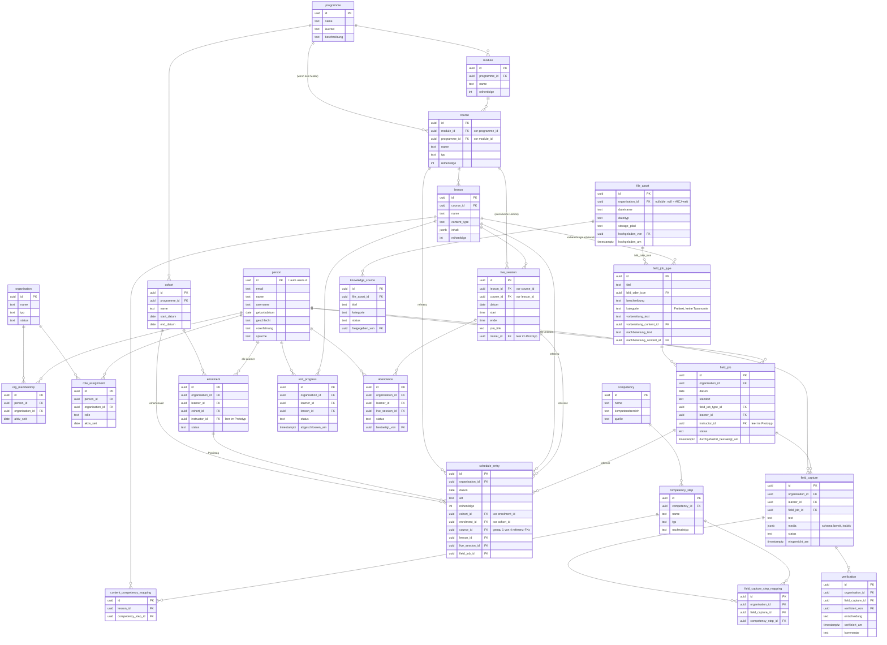

# ER-Diagramm — Qualifizierungsplattform Prototyp

> Generiert aus `data-model.md` + `access-matrix.md` (Instruktion 4e). Enthält jede
> mit "Prototyp: Ja" markierte Entität. `target_group` und `guidance_conversation`
> sind Later/Build-next und erscheinen bewusst nicht. `competency_evidence` ist
> keine Tabelle, sondern eine berechnete View (siehe Fußnote).

## Fußnote: `competency_evidence` (nicht im Diagramm)

`competency_evidence` ist absichtlich keine Tabelle (SR-01, Entscheidung
2026-09-04: "computed only"), daher taucht sie oben nicht als Entität auf. Sie ist
eine SQL-View (`supabase/migrations/0006_progress_and_evidence.sql`), berechnet als:

- `unit_progress` (status = abgeschlossen) **JOIN** `content_competency_mapping` → `quelltyp = lesson_completion`
- `verification` (entscheidung = verified) **JOIN** `field_capture` **JOIN** `field_capture_step_mapping` → `quelltyp = field_verification`

## Nicht abgebildet (bewusst, siehe data-model.md)

- `target_group` — Later, nicht Prototyp.
- `guidance_conversation` — Build next, nicht Prototyp.
